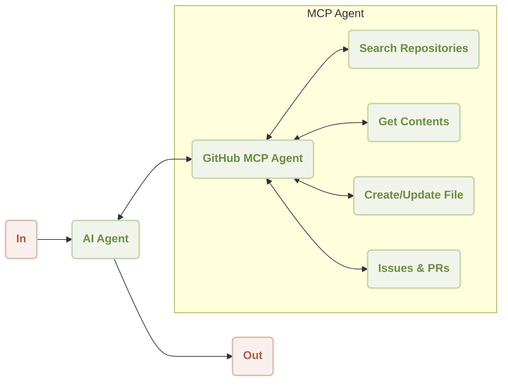
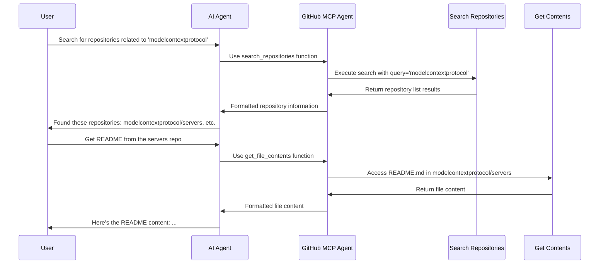

# GitHub MCP Server Integration

<p align="center">
  <picture>
    <source srcset="https://raw.githubusercontent.com/AIGNE-io/aigne-framework/main/logo-dark.svg" media="(prefers-color-scheme: dark)">
    <source srcset="https://raw.githubusercontent.com/AIGNE-io/aigne-framework/main/logo.svg" media="(prefers-color-scheme: light)">
    
  </picture>
</p>

This is a demonstration of using [AIGNE Framework](https://github.com/AIGNE-io/aigne-framework) and [GitHub MCP Server](https://github.com/modelcontextprotocol/servers-archived/tree/main/src/github) to interact with GitHub repositories. The example now supports both one-shot and interactive chat modes, along with customizable model settings and pipeline input/output.



Following is a sequence diagram of the workflow to search for repositories and access contents:



## Prerequisites

* [Node.js](https://nodejs.org) (>=20.0) and npm installed on your machine
* An [OpenAI API key](https://platform.openai.com/api-keys) for interacting with OpenAI's services
* [GitHub Personal Access Token](https://github.com/settings/tokens) with appropriate permissions
* Optional dependencies (if running the example from source code):
  * [Bun](https://bun.sh) for running unit tests & examples
  * [Pnpm](https://pnpm.io) for package management

## Quick Start (No Installation Required)

```bash
export OPENAI_API_KEY=YOUR_OPENAI_API_KEY # Set your OpenAI API key
export GITHUB_TOKEN=YOUR_GITHUB_TOKEN # Set your GitHub token

npx -y @aigne/example-mcp-github # Run the example
```

## Installation

### Clone the Repository

```bash
git clone https://github.com/AIGNE-io/aigne-framework
```

### Install Dependencies

```bash
cd aigne-framework/examples/mcp-github

pnpm install
```

### Setup Environment Variables

Setup your API keys in the `.env.local` file:

```bash
OPENAI_API_KEY="" # Set your OpenAI API key here
GITHUB_TOKEN="" # Set your GitHub Personal Access Token here
```

#### Using Different Models

You can use different AI models by setting the `MODEL` environment variable along with the corresponding API key. The framework supports multiple providers:

* **OpenAI**: `MODEL="openai:gpt-4.1"` with `OPENAI_API_KEY`
* **Anthropic**: `MODEL="anthropic:claude-3-7-sonnet-latest"` with `ANTHROPIC_API_KEY`
* **Google Gemini**: `MODEL="gemini:gemini-2.0-flash"` with `GEMINI_API_KEY`
* **AWS Bedrock**: `MODEL="bedrock:us.amazon.nova-premier-v1:0"` with AWS credentials
* **DeepSeek**: `MODEL="deepseek:deepseek-chat"` with `DEEPSEEK_API_KEY`
* **OpenRouter**: `MODEL="openrouter:openai/gpt-4o"` with `OPEN_ROUTER_API_KEY`
* **xAI**: `MODEL="xai:grok-2-latest"` with `XAI_API_KEY`
* **Ollama**: `MODEL="ollama:llama3.2"` with `OLLAMA_DEFAULT_BASE_URL`

For detailed configuration examples, please refer to the `.env.local.example` file in this directory.

### Run the Example

```bash
pnpm start # Run in one-shot mode (default)

# Run in interactive chat mode
pnpm start -- --chat

# Use pipeline input
echo "Search for repositories related to 'modelcontextprotocol'" | pnpm start
```

### Run Options

The example supports the following command-line parameters:

| Parameter | Description | Default |
|-----------|-------------|---------|
| `--chat` | Run in interactive chat mode | Disabled (one-shot mode) |
| `--model <provider[:model]>` | AI model to use in format 'provider\[:model]' where model is optional. Examples: 'openai' or 'openai:gpt-4o-mini' | openai |
| `--temperature <value>` | Temperature for model generation | Provider default |
| `--top-p <value>` | Top-p sampling value | Provider default |
| `--presence-penalty <value>` | Presence penalty value | Provider default |
| `--frequency-penalty <value>` | Frequency penalty value | Provider default |
| `--log-level <level>` | Set logging level (ERROR, WARN, INFO, DEBUG, TRACE) | INFO |
| `--input`, `-i <input>` | Specify input directly | None |

#### Examples

```bash
# Run in chat mode (interactive)
pnpm start -- --chat

# Set logging level
pnpm start -- --log-level DEBUG

# Use pipeline input
echo "Search for repositories related to 'modelcontextprotocol'" | pnpm start
```

## Example

The following example demonstrates how to use the GitHub MCP server to search for repositories:

```typescript
import { AIAgent, AIGNE, MCPAgent } from "@aigne/core";
import { OpenAIChatModel } from "@aigne/core/models/openai-chat-model.js";

// Load environment variables
const { OPENAI_API_KEY, GITHUB_TOKEN } = process.env;

// Initialize OpenAI model
const model = new OpenAIChatModel({
  apiKey: OPENAI_API_KEY,
});

// Initialize GitHub MCP agent
const githubMCPAgent = await MCPAgent.from({
  command: "npx",
  args: ["-y", "@modelcontextprotocol/server-github"],
  env: {
    GITHUB_TOKEN,
  },
});

// Create AIGNE
const aigne = new AIGNE({
  model,
  skills: [githubMCPAgent],
});

// Create AI agent with GitHub-specific instructions
const agent = AIAgent.from({
  instructions: `\
## GitHub Interaction Assistant
You are an assistant that helps users interact with GitHub repositories.
You can perform various GitHub operations like:
1. Searching repositories
2. Getting file contents
3. Creating or updating files
4. Creating issues and pull requests
5. And many more GitHub operations

Always provide clear, concise responses with relevant information from GitHub.
`,
});

// Example: Search for repositories
const result = await aigne.invoke(
  agent,
  "Search for repositories related to 'modelcontextprotocol'",
);

console.log(result);
// Output:
// I found several repositories related to 'modelcontextprotocol':
//
// 1. **modelcontextprotocol/servers** - MCP servers for various APIs and services
// 2. **modelcontextprotocol/modelcontextprotocol** - The main ModelContextProtocol repository
// ...

// Shutdown the aigne when done
await aigne.shutdown();
```

## Available GitHub Operations

The GitHub MCP server provides a wide range of operations including:

1. **Repository Operations**:

   * Search repositories
   * Create repositories
   * Get repository information

2. **File Operations**:

   * Get file contents
   * Create or update files
   * Push multiple files in a single commit

3. **Issue and PR Operations**:

   * Create issues
   * Create pull requests
   * Add comments
   * Merge pull requests

4. **Search Operations**:

   * Search code
   * Search issues
   * Search users

5. **Commit Operations**:
   * List commits
   * Get commit details

## License

This project is licensed under the MIT License.
