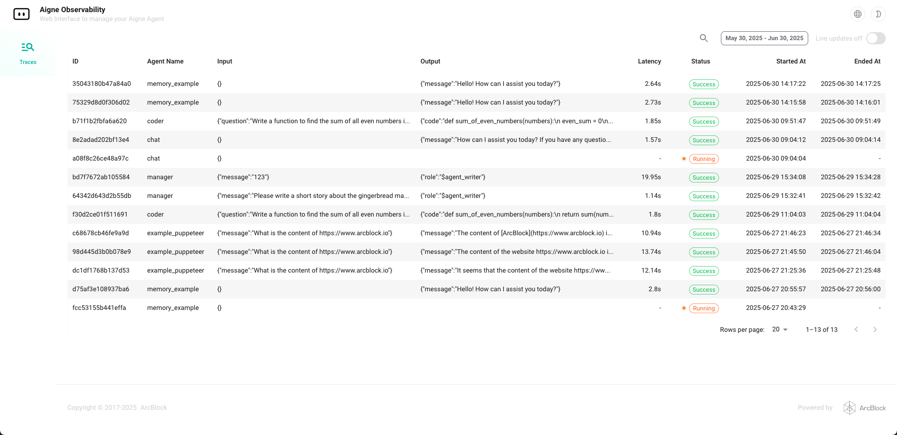
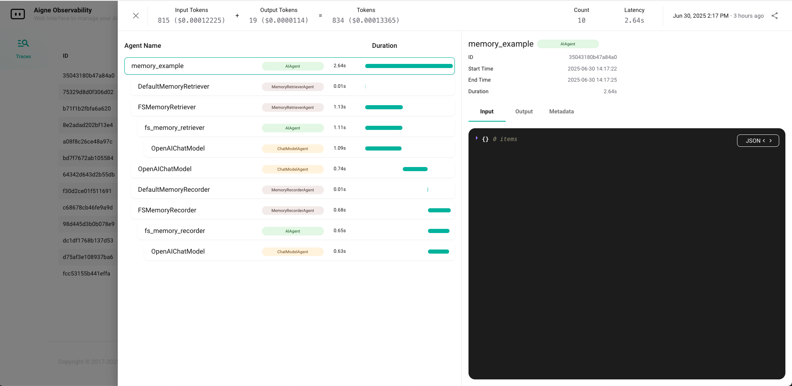

<p align="center">
  <picture>
    <source srcset="./logo-dark.svg" media="(prefers-color-scheme: dark)">
    <source srcset="./logo.svg" media="(prefers-color-scheme: light)">
    
  </picture>
</p>


# AIGNE Observability

A visual tool for monitoring Agent data flow, built on OpenTelemetry. Supports collection of both Trace and Log data. Can be used as a standalone service or integrated into the AIGNE runtime (AIGNE has this module integrated by default).

<picture>
  <source srcset="https://raw.githubusercontent.com/AIGNE-io/aigne-framework/main/assets/aigne-observability-dark.png" media="(prefers-color-scheme: dark)">
  <source srcset="https://raw.githubusercontent.com/AIGNE-io/aigne-framework/main/assets/aigne-observability.png" media="(prefers-color-scheme: light)">
  
</picture>




---

## ✨ Features

- 📊 Real-time visualization of trace data and call chains
- 🔍 Accurately pinpoint AIGNE internal workflows
- ☁️ Supports both local [AIGNE CLI](https://www.npmjs.com/package/@aigne/cli) and [Blocklet](https://store.blocklet.dev/blocklets/z2qa2GCqPJkufzqF98D8o7PWHrRRSHpYkNhEh) deployment

---

## 🧩 API Usage

AIGNE Observability can be integrated into your Node.js application programmatically, exposing two server start methods:

### 1. Blocklet/Server Mode

For Blocklet deployment or running as a standalone service.

```js
import { startObservabilityBlockletServer } from "@aigne/observability-api/server";

startObservabilityBlockletServer({
  port: Number(process.env.BLOCKLET_PORT) || 3000,
  dbUrl: path.join("file:", process.env.BLOCKLET_DATA_DIR || "", "observer.db"),
});
```

### 2. CLI Mode

It is suitable for local development, debugging or scenarios launched through CLI.

```js
import { startObservabilityCLIServer } from "@aigne/observability-api/cli";

startObservabilityCLIServer({
  port: 7890,
  dbUrl: "file:observer.db",
});
```

- Blocklet/Server mode is recommended for production and platform integration, supporting richer configuration and authentication.
- CLI/Local mode is lightweight and ideal for developer local experience and debugging.

For detailed parameters and advanced usage, please refer to the source code or TypeScript type definitions.
